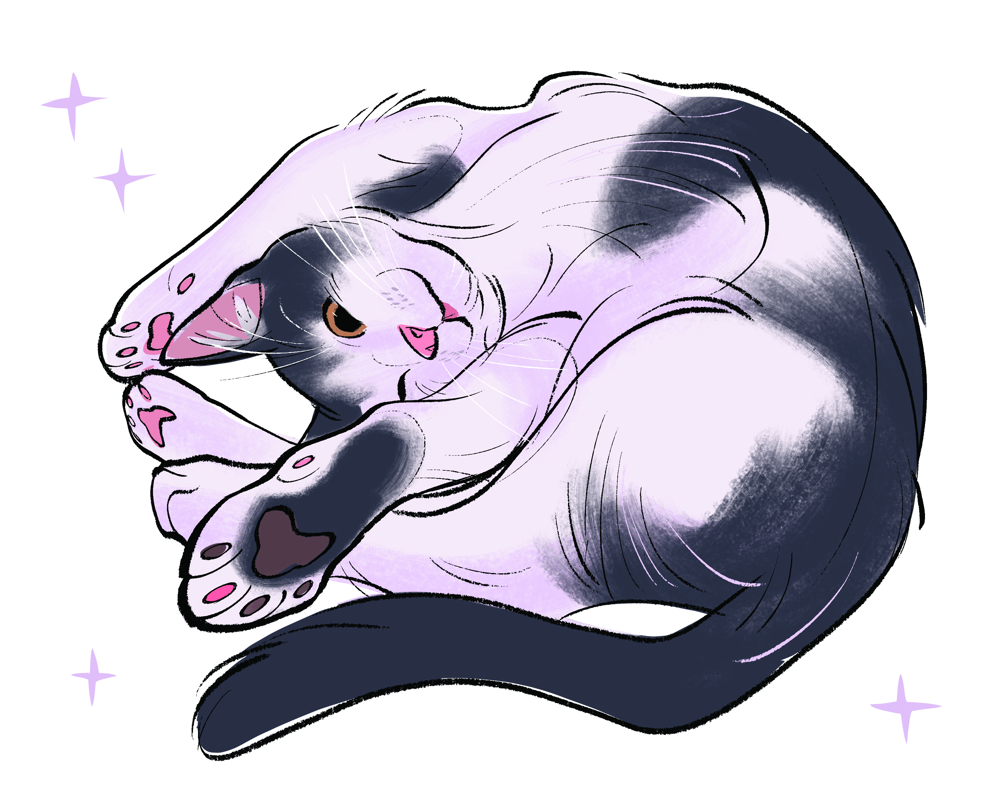

# tkphung

I am currently a scientist at Novartis developing and using computational modeling (quantitative systems pharmacology, pharmacokinetics, pharmacodynamics) for drug development. 

Previously, I worked as a postdoc at Harvard T.H. Chan School of Public Health developing automated image analysis techniques to study airway epithelial cell biology. And I studied biomedical engineering at the University of Virginia where I developed computational electromechanical models to guide patient-specific cardiac therapies.

You can see some of my work here: [github.com/tkphung]({{ site.github }})

Thanks for reading this- as a reward here is a drawing of my cat [*Chad Michael Purry*](https://www.instagram.com/chadmichaelpurry/).

Drawn by the talented [@tinytarakeet](https://www.instagram.com/tinytarakeet/).